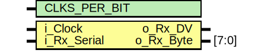
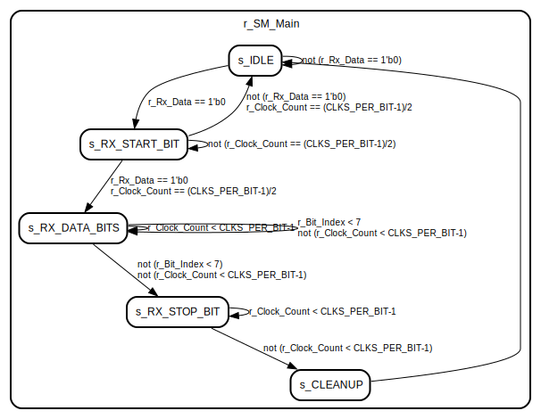

# Entity: uart_rx 
- **File**: uart_rx.v

## Diagram

## Generics

| Generic name | Type | Value | Description |
| ------------ | ---- | ----- | ----------- |
| CLKS_PER_BIT |      | 1     |             |

## Ports

| Port name   | Direction | Type  | Description |
| ----------- | --------- | ----- | ----------- |
| i_Clock     | input     |       |             |
| i_Rx_Serial | input     |       |             |
| o_Rx_DV     | output    |       |             |
| o_Rx_Byte   | output    | [7:0] |             |

## Signals

| Name               | Type      | Description |
| ------------------ | --------- | ----------- |
| r_Rx_Data_R = 1'b1 | reg       |             |
| r_Rx_Data   = 1'b1 | reg       |             |
| r_Clock_Count = 0  | reg [7:0] |             |
| r_Bit_Index   = 0  | reg [2:0] |             |
| r_Rx_Byte     = 0  | reg [7:0] |             |
| r_Rx_DV       = 0  | reg       |             |
| r_SM_Main     = 0  | reg [2:0] |             |

## Constants

| Name           | Type | Value  | Description |
| -------------- | ---- | ------ | ----------- |
| s_IDLE         |      | 3'b000 |             |
| s_RX_START_BIT |      | 3'b001 |             |
| s_RX_DATA_BITS |      | 3'b010 |             |
| s_RX_STOP_BIT  |      | 3'b011 |             |
| s_CLEANUP      |      | 3'b100 |             |

## Processes
- unnamed: ( @(posedge i_Clock) )
  - **Type:** always
- unnamed: ( @(posedge i_Clock) )
  - **Type:** always

## State machines

